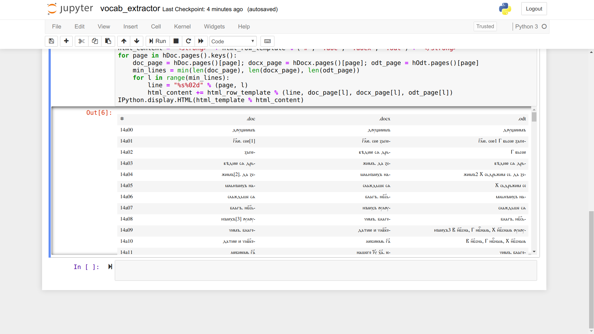

# Индекс за Учителско Евангелие
Проект за създаване на полу-автоматичен индекс за средновековен ръкопис.

Все още не съм успял да направя приложението да работи интерактивно на този сайт. Затова прикачвам екран с предварителен изглед на това, което работи на моя компютър:

Настоящето състояние на интерактивния проект може да бъде видяно в дъното на <a href="https://github.com/mapto/UchitelskoEvangelie/blob/master/vocab_extractor.ipynb">скриптираната страница</a>.

Примерът показва извличането от документ. Това не е гладък процес и ми се наложи да правя експерименти с три различни файлови формата (съответно .DOC, .DOCX и .ODT), за да видя от кой ще бъде изнесена информацията в най-чист и най-удобен за ползване вид. Тук допускането е, че конверитирането между форматите е лесна стъпка, която може да бъде извършена както с <a href="https://products.office.com/word">Microsoft Word</a>, така и с <a href="https://www.libreoffice.org/discover/writer/">LibreOffice Writer</a>.

Веднъж изчистен извлечения текст, ще развия таблицата до необходимата структура и ще го експортирам в необходимия формат (или формати).

Понастоящем, с цел лесна демонстрация, тук е публикувана и примерната глава (в трите файлови формата), която ми изпратихте за проби. Този сайт не може да бъде направен публичен докато тези материали не бъдат премахнати, а сайтът трансформиран така, че да работи с файлове, подадени от потребителя.

Използваният типографски шрифт *Cyrillica Ochrid 10U* е „раздаван безплатно“ <a href="https://osvedomitel.bg/2020/02/prof-totomanova/">по думите</a> на представител на притежателите на лиценза от БАН.
