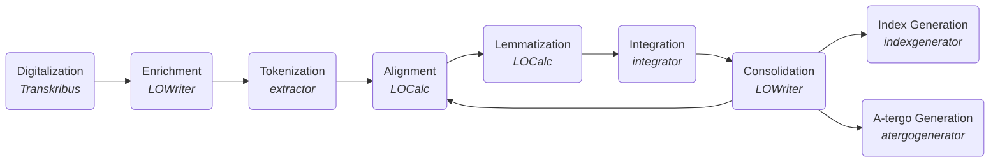

# Bilingual Word Indices to Medieval Slavonic Translations and Copies
A toolset for the generation of bilingual dictionaries for the medieval Slavonic translations of Greek and their copies. These tools support philology researchers in the ellaboration of the word-level alignment between the two texts. The project has started to serve the research on [„Учително евангелие“](https://uchitelnoevangelie.eu/?lang=en) (Uchitel’noe evangelie - Didactic Gospel) by Constantine of Preslav, but is designed to also be used on other Slavonic-Greek parallel texts. Wider application could also be possible, we encourage researchers to get in contact to discuss applicability.

Three software tools (used from the command line interface or via drag & drop) are at the core of this project:
1. [extractor](extractor/) - for the transformation of word usages from original Old Church Slavonic texts into tabular form to be used as a basis of the database (in .xlsx spreadsheets for easy manual editing), later enriched and annotated by the language experts. This is basically tokenizing the text into one word per line.
2. [integrator](integrator/) - for the interpretation of the lexicographic annotations from that database and the creation of indexes used for validation. These are indices for both Slavonic to Greek and Greek to Slavonic and include annotations for variations in copies. This tool allows the language expert to iteratively correct possible mistakes in the annotation.
3. [indexgenerator](integrator/) (also in the integrator directory, due to shared codebase) - for the generation of final bilingual indices to be published.
4. [atergogenerator](integrator/) (also in the integrator directory, due to shared codebase) - for the generation of a-tergo (reverse) bilingual indices to be published.

There are further two auxiliary instruments:

4. [demonstrator](/integrator/demonstrator.ipynb) - allows inspecting how the integrator and indexgenerator work on particular phrases
5. [statistics](/integrator/statistics.py) - a counter of content in tables

The programs use the <a href="https://en.wikipedia.org/wiki/Office_Open_XML">Office Open XML</a> file format, and the <a href="https://github.com/python-openxml/python-docx">python-docx</a> and <a href="https://pypi.org/project/openpyxl">openpyxl</a> programming libraries.
The tools are used within the following workflow using only freely available instruments (including <a href= "https://transkribus.eu/">Transkribus</a> and the <a href="https://www.libreoffice.org/">LibreOffice package</a>):

1. Digitalization - digitialisation of the texts (on how to use Transkribus, see this <a href="https://www.youtube.com/watch?v=X1NxWYWCe9g">presentation by Achim Rabus</a>).
2. Enrichment - manual annotation of the relevant variations, see [input](extractor/).
2. Extraction - automated extraction of word usages in tabular form (spreadsheet) from the enriched document, see [illustration](extractor/).
3. Alignment of the Slavonic and Greek texts - this and the following steps are the focus of a peer-reviewed publication - how asymetric cases and variations in copies are being addressed, see [publication](docs/ruskov-taseva-DIPRAL2022.pdf).
4. Lemmatization - inclusion of lemmatization for each word in the spreadsheet, see [lemma and sublemma explanation](integrator/).
5. Integration - processing of the spreadsheet, generating verification indices, see [animation](integrator/).
6. Consolidation - review of the intermediary index to locate and remove mistakes.
7. Index Generation - final generation of the word indices, see [illustration](integrator/).
7. A-tergo Generation - final generation of the a-tergo indices, see [examples](integrator/test/).

# Download

The interpretable source code can be downloaded from here and can be used without compilation, see below for instructions.

Executable binaries can be downloaded from <a href="https://www.dropbox.com/sh/gv879jbqrvze861/AAC6Vt6OdfESe3rn04HXK9hWa?dl=0">Dropbox</a>.

# Compilation

Compilation is not a requirement. Executable binaries could be created using Linux, MacOSX and Windows Subsystem for Linux. To do this, one needs to download the source and install a version of <a href="https://www.docker.com/">docker</a>. Then the following command from the project root directory needs to be executed (requires super user privileges):

    sudo ./build.sh

This will create binaries for Linux, Windows and Mac in the `dist` directory.

# Usage

The program can be compiled and/or used with a current version of python (3.6+).

Make sure when using `integrator`, `indexgenerator` and `atergogenerator` to provide the source list configuration files, see [`sl-sources.txt`](integrator/sl-sources.txt) and [`gr-sources.txt`](integrator/gr-sources.txt). The first line in each contains the main manuscript reference. For the way how default (implicit) variant source is indicated, see implementation in [`config.py`](integrator/config.py), lines [`DEFAULT_SL: str = "".join(VAR_SL)`](integrator/config.py#L52) and [`DEFAULT_GR: str = VAR_GR[0]`](integrator/config.py#L54).

The font face <a href="https://www.starobulglit.eu/OC10U.ttf">*Cyrillica Ochrid 10U*</a> needs to be downloaded and installed on the host system for visualisation of the Cyrillic script. Alternatively, configure an alternative font for both [exporter](extractor/exporter.py#L23) and [integrator](integrator/wordproc.py#L12).

## Interpreted version

To work without compilation, first the necessary dependencies need to be installed. This is done by the following command, executed in the subdirectory of the tool of interest:

    pip install -r requirements.txt

The programs are executed with:

    python extractor.py <docx>
    python integrator.py <xlsx>
    python indexgenerator.py <xlsx>
    python atergogenerator.py <xlsx>

## Compiled version

If you posses a compiled version, it suffices to drag and drop the file to be processed on the tool. For extractor, acceptable are .docx files, and for integrator and indexgenerator, .xlsx files.

The extractor tool also has a command line interface, whose parameters could be seen by starting the program without parameters or in the <a href="extractor/extractor.py">inline documentation</a>.

# Reporting errors

For Windows, how to share the error from the program when it closes immediately:

1. Press the Win+R key combination to run the program
As a result, a small window should open with a single line text box.
2. In the window that opens, type "cmd" and press the Enter key.
As a result, a black window should open with the command line
3. In the black window that opens, drag+drop the program
The name of the program appears with its full path.
4. Put the focus on the black window and press the space bar that appears between the program name and the cursor
5. In the black window, drag+drop the word
After the program and the space, the name of the word appears with its entire path
6. Put the focus on the black window and press Enter
As a result, the program is run in the black window and the error that is otherwise hidden remains visible
7. Press the key combination Win+PrtScr to take a screenshot of the screen
The screenshot is saved to the Pictures > Screenshot folder on your computer
8. Open an <a href="https://github.com/mapto/UchitelnoEvangelie/issues">issue</a> in this project and attach the screenshot to it.

# References

Please cite as:

[en] Ruskov, M., Taseva, L. (2022), _Computer-Aided Modelling of the Bilingual Word Indices to the Nineth-Century Uchitel'noe evangelie_, Proceedings of 1st International Workshop on Digital Platforms and Resources for Access to Literary Heritage, Padua, Italy, September 20, 2022. (CEUR-WS 3246), 19-30. https://ceur-ws.org/Vol-3246/03_paper-6921.pdf

[bg] Ruskov, M., & Taseva, L. (2024). Специализирани софтуерни инструменти за създаването на речниците към Учителното евангелие / Software Support Tools for the Creation of Word Indices to the Constantine of Preslav’s Didactic Gospel. Учителното Евангелие На Константин Преславски и Южнославянските Преводи На Хомилетични Текстове (IX–XIII в.). Филологически и Интердисциплинарни Ракурси. Доклади От Международната Научна Конференция в София 25–27 Април 2023 г. / Constantine of Preslav’s Didactic Gospel and the South Slavonic Homiletic Texts (9th-13th Century) Philological and Interdisciplinary Aspects: : Proceedings of the International Scientific Conference in Sofia, April 25-27, 2023. (Studia Balcanica 37), 431-451. https://doi.org/10.62761/491.SB37.18

Citations also available as [BibTex](docs/refs.bib).

# Copyrights

Freely distributed under the <a href="https://mit-license.org/">MIT License</a>.

The font face <a href="https://www.starobulglit.eu/OC10U.ttf">*Cyrillica Ochrid 10U*</a> used for Slavonic is freely distributed, and can be downloaded e.g. from journal sites like <a href="https://palaeobulgarica.eu/en/guidelines-authors">Palaeobulgarica</a> or <a href="http://www.starobulglit.eu/en/publication-guidelines/">Starobulgarska Literatura</a>.

For the creation of the icons, the FontAwesome <a href="https://fontawesome.com/icons/book-open?style=solid">open-book icon</a> has been used, distributed under <a href="https://creativecommons.org/licenses/by/4.0/">Creative Commons Attribution 4.0 international</a>.

# Acknowledgments

This work is part of the project _The Vocabulary of Constantine of Preslav’s Uchitel’noe
evangelie (’Didactic Gospel’): Old Bulgarian-Greek and Greek-Old Bulgarian Word Indices_, https://uchitelnoevangelie.eu/, funded
by the Bulgarian National Science Fund (contract КП-06-Н50/2 of 30.11.2020).
