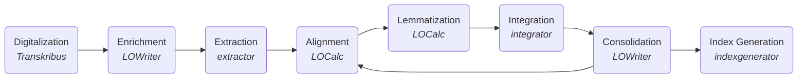

# Bilingual Word Indices to Medieval Slavonic Translations and Copies
A toolset for the generation of bilingual dictionaries for the medieval Slavonic translations of Greek and their copies. These tools support philology researchers in the ellaboration of the word-level alignment between the two texts. The project has started to serve the research on <a href="https://uchitelnoevangelie.eu/?lang=en">„Учително евангелие“</a> (Uchitel’noe evangelie - Didactic Gospel) by Constantine of Preslav, but is designed to also be used on other Slavonic-Greek parallel texts. Wider application could also be possible, we encourage researchers to get in contact to discuss applicability.

Three software tools are at the core of this project:
1. `[exporter.py](exporter/README.md)` - for the transformation of word usages from original Old Church Slavonic texts into tabular form to be used as a basis of the database (in .xlsx spreadsheets for easy manual editing), later enriched and annotated by the language experts.
2. `integrator.py` - for the interpretation of the lexicographic annotations from that database and the creation of indexes used for validation. These are indices for both Slavonic to Greek and Greek to Slavonic and include annotations for variations in copies. This tool allows the language expert to iteratively correct possible mistakes in the annotation.
3. `indexgenerator.py` (also in the integrator directory, due to shared codebase) - for the generation of final bilingual indices to be published.

The programs use the <a href="https://en.wikipedia.org/wiki/Office_Open_XML">Office Open XML</a> file format, and the <a href="https://github.com/python-openxml/python-docx">python-docx</a> and <a href="https://pypi.org/project/openpyxl">openpyxl</a> programming libraries.

The tools are used within the following workflow using only freely available instruments (including <a href= "https://transkribus.eu/">Transkribus</a> and the <a href="https://www.libreoffice.org/">LibreOffice package</a>):

1. Digitalization - digitialisation of the texts (on how to use Transkribus, see this <a href="https://www.youtube.com/watch?v=X1NxWYWCe9g">presentation by Achim Rabus</a>)
2. Enrichment - manual annotation of the relevant variations
2. Extraction - automated extraction of word usages in tabular form (spreadsheet) from the enriched document
3. Alignment of the Slavonic and Greek texts - this and the following steps are the focus of a peer-reviewed publication - how asymetric cases and variations in copies are being addressed
4. Lemmatization - inclusion of lemmatization for each word in the spreadsheet
5. Integration - processing of the spreadsheet, generating verification indices
6. Consolidation - review of the intermediary index to locate and remove mistakes
7. Index Generation - final generation of the word indices

# Download

The interpretable source code can be downloaded from here and can be used without compilation, see below for instructions.

Executable binaries can be downloaded from <a href="https://www.dropbox.com/scl/fo/i8e2nl7dbgbprul4fwhr3/h?dl=0&rlkey=gybrbjvxcedeml98g6flv076y">Dropbox</a>.

# Compilation

Compilation is not a requirement. Executable binaries could be created using Linux, MacOSX and Windows Subsystem for Linux. To do this, one needs to download the source and install a version of <a href="https://www.docker.com/">docker</a>. Then the following command from the project root directory needs to be executed (requires super user privileges):

    sudo ./build.sh

This will create binaries for Linux and Windows in the `dist` directory.

Alternative (also on Mac) is using pyinstaller, for example for integrator:

    pip install pyinstaller
    pyinstaller --clean -y --dist ./dist/linux --workpath /tmp integrator.spec

# Usage

The program can be compiled and/or used with a current version of python (3.6+).

## Interpreted version

To work without compilation, first the necessary dependencies need to be installed. This is done by the following command, executed in the subdirectory of the tool of interest:

    pip install -r requirements.txt

The programs are executed with:

    python3 extractor.py <docx>
    python3 integrator.py <xlsx>
    python3 indexgenerator.py <xlsx>

## Compiled version

If you posses a compiled version, it suffices to drag and drop the file to be processed on the tool. For extractor, acceptable are .docx files, and for integrator and indexgenerator, .xlsx files.

The extractor tool also has a command line interface, whose parameters could be seen by starting the program without parameters or in the <a href="https://github.com/mapto/UchitelnoEvangelie/blob/master/extractor.py">inline documentation</a>.

# Copyrights

Freely distributed under the <a href="https://mit-license.org/">MIT License</a>.

The font face <a href="https://www.starobulglit.eu/OC10U.ttf">*Cyrillica Ochrid 10U*</a> used for Slavonic is freely distributed, and can be downloaded e.g. from journal sites like <a href="https://palaeobulgarica.eu/en/guidelines-authors">Palaeobulgarica</a> or <a href="http://www.starobulglit.eu/en/publication-guidelines/">Starobulgarska Literatura</a>.

For the creation of the icons, the FontAwesome <a href="https://fontawesome.com/icons/book-open?style=solid">open-book icon</a> has been used, distributed under <a href="https://creativecommons.org/licenses/by/4.0/">Creative Commons Attribution 4.0 international</a>.
