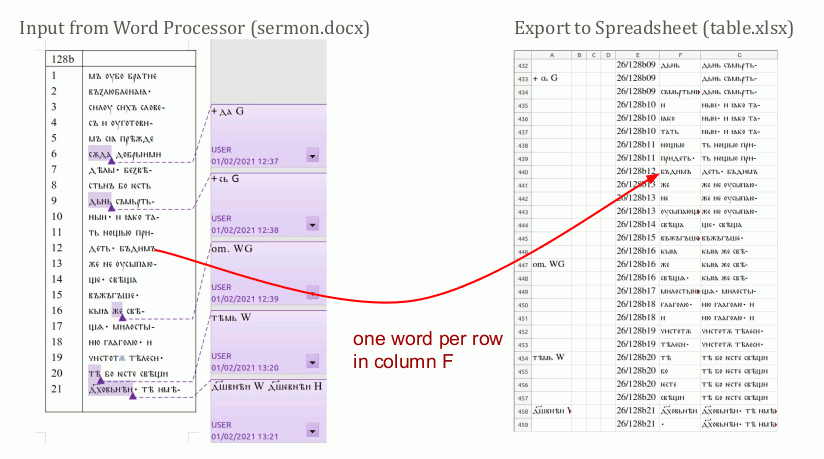

The vocabulary extractor takes an annotated document and extracts an aligned (between variants) vocabulary spreadsheet. It also adds some spreadsheet formulas to improve usability (i.e. autofill on repetitions).

Example:

 [src](https://docs.google.com/presentation/d/139kNBtE6D1VM_1ScXHugP0nJWT8lVl61_zyEFkcxvU0/edit?usp=sharing)

See futher examples in [test](test/)