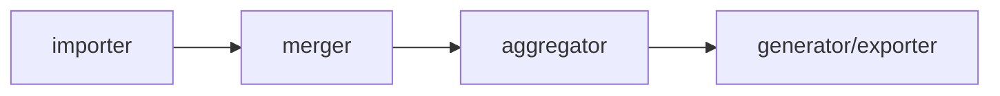
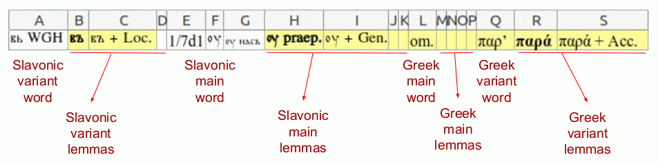
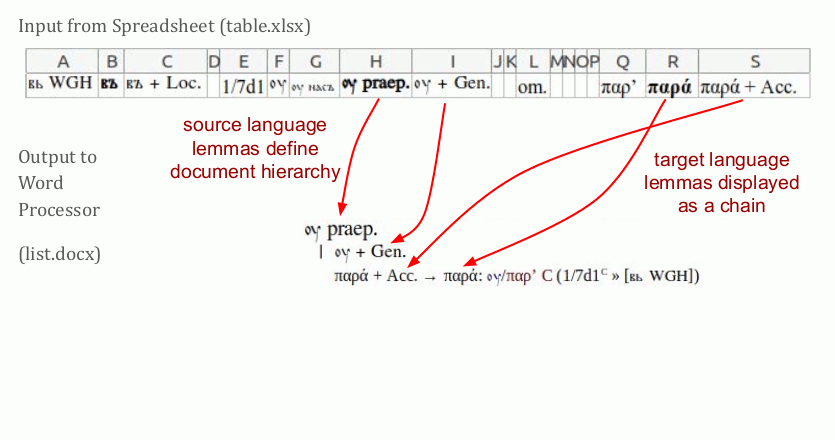
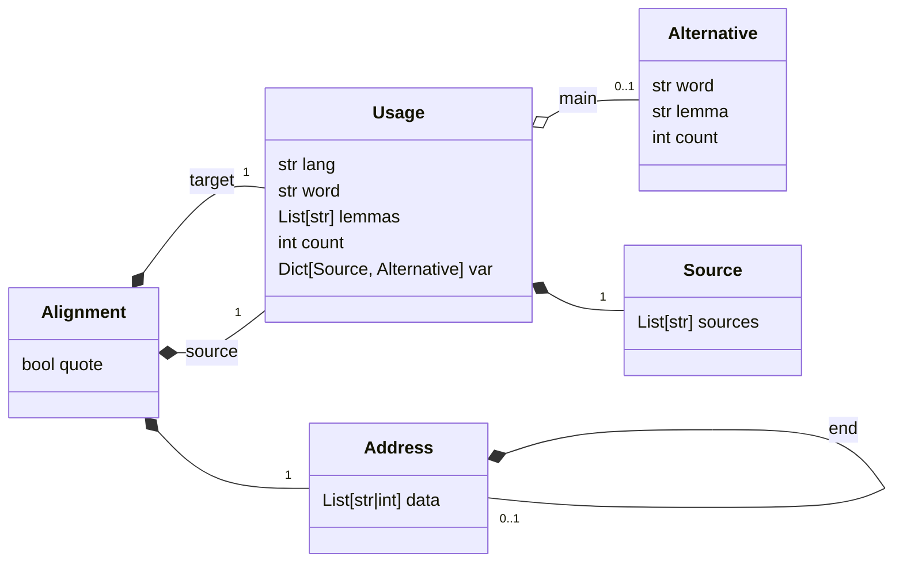
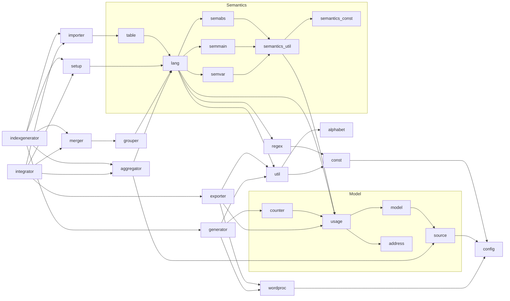

Main difference between `integrator` and `indexgenerator` is that they respectively depend on `exporter` and `generator`. Otherwise, they follow a similar pipeline.

# Guide to the Generated Indices

Below an explanation of the columns in a table, as documented in [setup.py](setup.py#L33).

The below animation illustrates how a completed table is being converted into a list.

 

This image shows what in the index is different from the list.

 [src](https://docs.google.com/presentation/d/1QJGfndGEz3s0MTzaVZ7T3PywzJ_DmIANtfSbkfgmQBs)

See futher examples for both in [test](test/)

## Recognised Sources

The range of sources are provided in [`sl-sources.txt`](sl-sources.txt) and [`gr-sources.txt`](gr-sources.txt). The first line in each contains the main manuscript reference. For the way how default (implicit) variant source is indicated, see implementation in [`config.py`](config.py), lines [`DEFAULT_SL: str = "".join(VAR_SL)`](config.py#L52) and [`DEFAULT_GR: str = VAR_GR[0]`](config.py#L54). The rest of the sources need to be ordered in order of importance, and this is the way they will be ordered when collocated in the produced indices.

When unrecognised sources are encountered, the program reports an error.

# Data Model

# Dependency Tree

