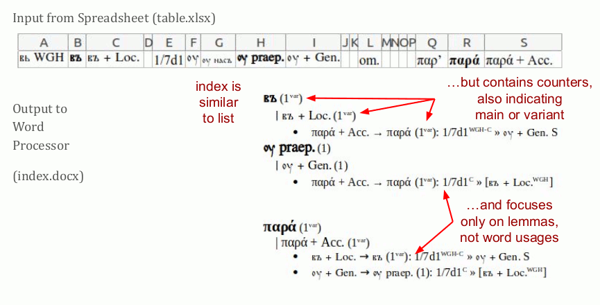

See a explanation of the columns in a table, as documented in [setup.py](setup.py#L33).

 [src](https://docs.google.com/presentation/d/1QJGfndGEz3s0MTzaVZ7T3PywzJ_DmIANtfSbkfgmQBs)

The below animation illustrates how a completed table is being converted into a list.

 [src](https://docs.google.com/presentation/d/1QJGfndGEz3s0MTzaVZ7T3PywzJ_DmIANtfSbkfgmQBs)

This image shows how the index differs from the list.

 [src](https://docs.google.com/presentation/d/1QJGfndGEz3s0MTzaVZ7T3PywzJ_DmIANtfSbkfgmQBs)

See futher examples for both in [test](test/)