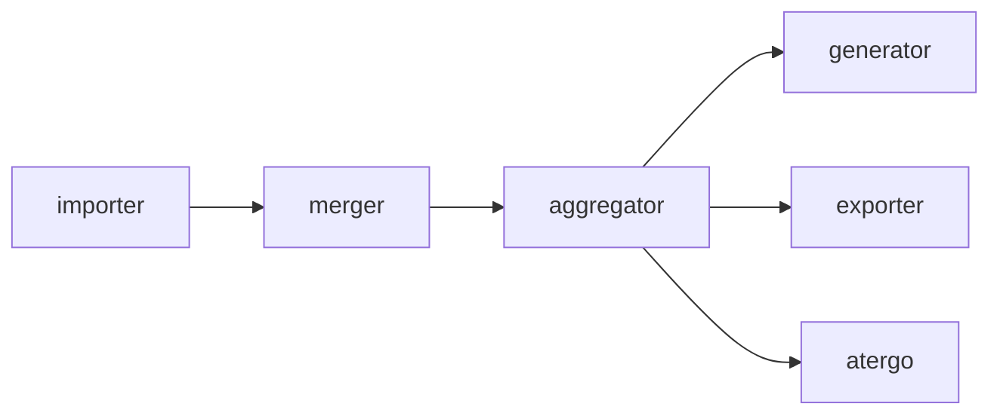
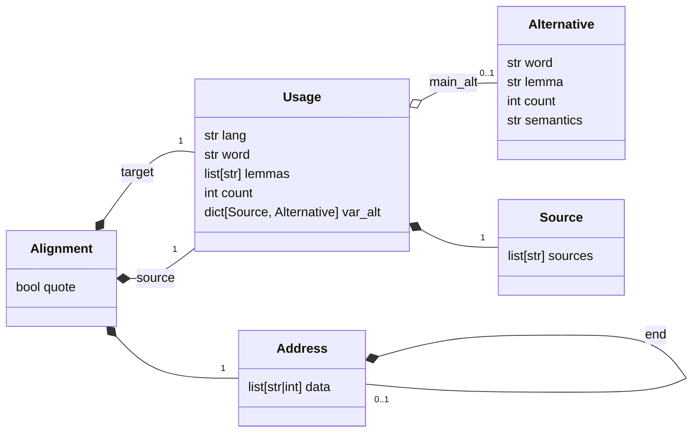
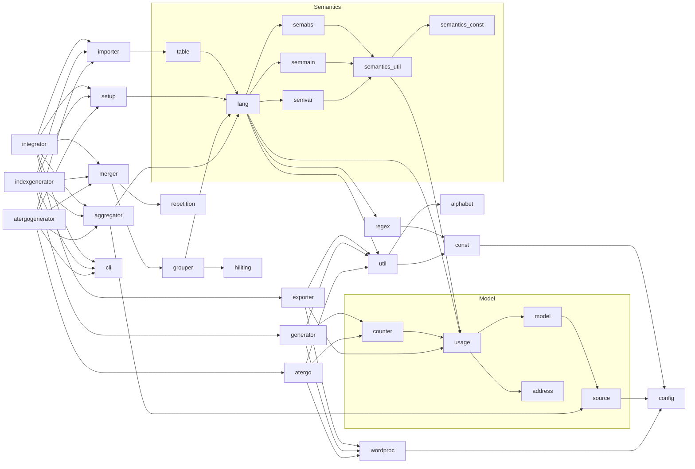

# Integrator and Index Generator

Main difference between `integrator`, `indexgenerator` and `atergogenerator` is that their output is respectively produced by [exporter.py](exporter.py), [generator.py](generator.py) and [atergo.py](atergo.py). Otherwise, they follow a similar pipeline.

## Biblical citations

For to be indicated as part of a biblical citation, a word needs to be marked as bold and italic. In general bold and italic are being preserved into the integrator list and generated index.

## Guide to the Generated Indices

Below an explanation of the columns in a table, as documented in [setup.py](setup.py#L33).

The below animation illustrates how a completed table is being converted into a list.

 

This image shows what in the index is different from the list.

 [src](https://docs.google.com/presentation/d/1QJGfndGEz3s0MTzaVZ7T3PywzJ_DmIANtfSbkfgmQBs)

The atergo dictionary is based on the index, but simpler in that it does not show any correspondences. And, of course, it is ordered differently (alphabetically by reverse spelling).

See futher corresponding examples in [test](test/)

### Translation Asymmetries

When it comes to text alignment at the word level, asymmetries are a key complication. Highlighting - or background colouring - is used to annotate the intention:
* When several words need to be considered as a phrase, this grouping needs to be indicated in the spreadsheet by changing the background colour of one of the word columns for all the rows in the phrase.
* When a lemma has to be included in the group for its langauge, but not in the translation, this can be encoded as highlighting of the second lemma
* When a word has some special function (e.g. grammatical, conditional, passive, etc), a third or later lemmas needs to be indicated by changing its background colour.

This is better explained in the related [publications](../docs/)

### Semantic Relationships

Another emergent complication is the imprecise correspondence as indicated by the following [SPECIAL_CHARS](const.py#L24):

* `≈` is approximate relationship
* `≠` indicates clearly different
* `#` used for contextual translation
* `*` is legacy annotation, but is present in some tests

In the resulting word indices, these need to show up in:

* the category of the last sublemma of the original (solved in [aggregator->reorganise_orig_special()](aggregator.py#28))
* the last sublemma in the translation path (solved in [model/model->Path](model/model.py#85))
* in the alternative words for the integrator (solved in [aggregator->reorganise_trans_special()](aggregator.py#57))
* in the alternative lemmas for the indexgenerator (solved in [aggregator->reorganise_trans_special()](aggregator.py#57))

### Recognised Sources

The range of sources are provided in [`sl-sources.txt`](sl-sources.txt) and [`gr-sources.txt`](gr-sources.txt). The first line in each contains the main manuscript reference. For the way how default (implicit) variant source is indicated, see implementation in [`config.py`](config.py), lines [`DEFAULT_SL: str = "".join(VAR_SL)`](config.py#L68) and [`DEFAULT_GR: str = VAR_GR[0]`](config.py#L72). The rest of the sources need to be ordered in order of importance, and this is the way they will be ordered when collocated in the produced indices.

When unrecognised sources are encountered, the program reports an error.

### Alphabetic ordering

In old writing there are also non-UTF-8 symbols. These still need to be ordered alphabetically. Our approach is to reorder them to fit the conventional alphabet. Sometimes this means reordering them between other letters, in other cases making them equivalent to simpler transcriptions. This is all defined in [`alphabet.py`](alphabet.py) and used in [`util.py](util.py). For [Cyrillic symbols](https://www.fileformat.info/info/unicode/block/cyrillic/list.htm) [the first approach](alphabet.py#L14) is more common, whereas fro [Greek](https://www.fileformat.info/info/unicode/block/greek_extended/list.htm), [the second](alphabet.py#L188) is possible. Further possible relevant ranges could be explored here: https://www.fileformat.info/info/unicode/block/index.htm

## Multivariant annotation

Since the number of source variants could be very big (currently about 30 for Greek), it is imperative that all this variation can be represented in a manageable number of columns. As a consequence, for each language, within the variants column, multiple variants can be encoded. To make this possible, a single cell could contain multiple word usages or lemmas. Such cells are parsed with regular expressions, defined in [`regex.py`](regex.py). This feature is shortly mentioned in the [related publications](../docs/), verified in the [tests](./test/) and visualised here using https://debuggex.com and interpeted (see guides to regex groups) with https://regex101.com/.

### Variant Word
 

A guide to regex groups follows:

1. Possible word usage and/or annotation group
2. The last part of potentially repetitive elements of group 1
3. The group of all possible sources
4. A source sigle (as parsed by [`config.py`](config.py))
5. potential other patterns (following the same pattern)

### Variant Lemmas
 

A guide to regex groups can be found in [`regex.py`](regex.py).

1. Possible semantic and lemma group
2. A group representing a possible semantic relationship (defined in [`const.py`](const.py)) (LP_PRE)
3. A possible lemma (LP_LEM)
4. A possible annotation, including ommissions, grammar, declinations, etc. (some of these defined for other purposes in [`const.py`](const.py)) (LP_ANN)
5. Possible `+` indicating e.g. that the lemma is used with a particular decliation
6. Content part of the annotation
7. The group of all possible sources (LP_SRC)
8. A source sigle (as parsed by [`config.py`](config.py)) 
9. A potential separator (used only at top lemma level, defined in [`const.py`](const.py)) (LP_SEP)
10. potential other patterns (following the same pattern) (LP_OTHER)

## Data Model

## Dependency Tree

